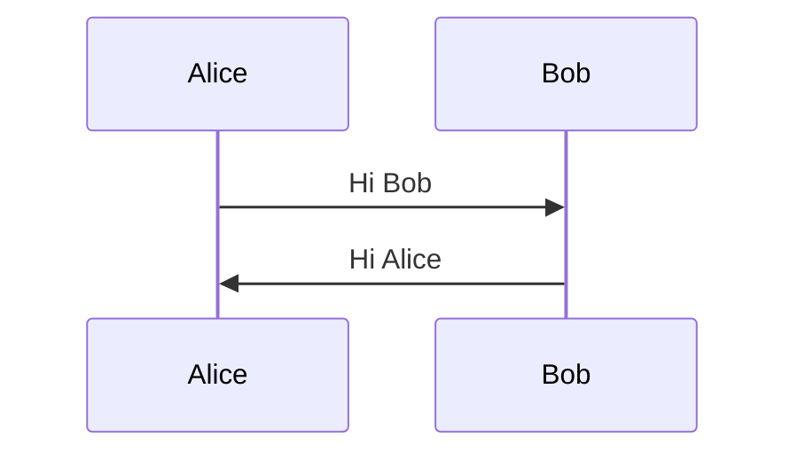

# {title}

> {description}

"{excerpt}"

## A Code Snippet example

A Cope Snippet example 👋

```ts
function greet(name: string) {
	console.log(`Hey ${name}! 👋`);
}
```

True innovation often comes from the small startup who is lean enough to launch a market but lacks the heft to own it.
(Timm Martin) A programmer is a person who passes as an exacting expert on the basis of being able to turn out, after
innumerable punching, an infinite series of incomprehensive answers calculated with micrometric precisions from vague
assumptions based on debatable figures taken from inconclusive documents and carried out on instruments of problematical
accuracy by persons of dubious reliability and questionable mentality for the avowed purpose of annoying and confounding
a hopelessly defenseless department that was unfortunate enough to ask for the information in the first place.
(IEEE Grid newsmagazine) Programming today is a race between software engineers striving to build bigger and better idiot-proof
programs, and the universe trying to produce bigger and better idiots. So far, the universe is winning. (Rick Cook)
It’s ridiculous to live 100 years and only be able to remember 30 million bytes. You know, less than a compact disc.
The human condition is really becoming more obsolete every minute. (Marvin Minsky)

The first 90% of the code accounts for the first 90% of the development time. The remaining 10% of the code accounts for the other 90% of the development time. (Tom Cargill)

Don’t worry if it doesn’t work right. If everything did, you’d be out of a job. (Mosher’s Law of Software Engineering)
